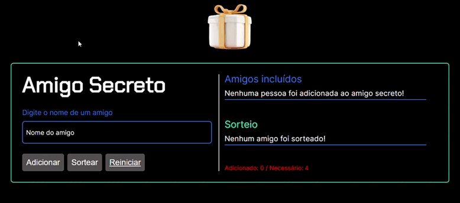

# Secret Friend

## About

The secret friend project is based on drawing several friends that have been added by the user, it will not add empty fields, or even reset or draw without the appropriate validations having been carried out.

Note that it is very important that you initially have 4 friends registered, if you have registered even numbers the program will not run the game, any number less than 4 or odd will be blocked from carrying out the draw.

## Layout

Here is the link to access the project - deploy:
[Secret Friend](https://secret-friend-psi.vercel.app/).



## How to execute the project?

```bash
# Terminal

git clone https://gitlab.com/mateusdev3400/secret-friend
git clone https://github.com/mateusdev3400/secret-friend

cd secret-friend/

index.html # Live Server

```

## Technologies

The following tools were used in the construction of the project:

### Frontend

- HTML5
- CSS3
- JavaScript

## Contributors

<table>
    <thead>
        <tr>
            <td>
                
            </td>
        </tr>
    </thead>
    <tbody>
        <tr>
            <th>Mateus Maciel</th>
        </tr>
    </tbody>
</table>

### How to contribute

- Fork the project.
- Create a new branch with your changes: ```bash git checkout -b my-feature```
- Save the changes and create a confirmation message telling you what you did: ```git commit -m "modified file"```
- Submit your changes: ```git push origin my-feature```

## Licença

This project is licensed under the Alura Cursos license.